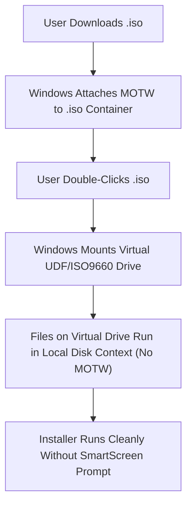

# 🧾 InvoicePro (Offline Estimate Bill Printer)

<div align="center">


**InvoicePro is an ultra-fast, offline-first Windows desktop application built for shops, traders, wholesalers, and small businesses to generate clean, ink-saving Estimate Bills ("Kacha Bill" / Quotations) with instant local persistence and zero setup.**

Developed by **[Chirag Chak](https://chiragchak.in)** • [📥 Download Latest Release](#-download--installation) • [✨ Features](#-key-features) • [💻 Developer Guide](#-for-developers-build--run-from-source)

</div>

---

## 📥 Download & Installation

Visit the **[GitHub Releases](https://github.com/inkedpagex/offlineinvoice/releases)** tab or **[chiragchak.in](https://chiragchak.in)** to download the latest release:

### 🌟 Option 1: Mountable ISO Image (Recommended)
> **Best for seamless installation with zero Windows Defender SmartScreen warnings.** Windows mounts ISO files in a virtual disk context, preventing "Mark of the Web" (MOTW) false alarms.

1. Download **`InvoicePro_Setup_v1.0.0.iso`** from [Releases](https://github.com/inkedpagex/offlineinvoice/releases).
2. **Double-click** the `.iso` file — Windows Explorer will natively mount it as a virtual drive.
3. Double-click **`InvoicePro Setup 1.0.0.exe`** inside the virtual drive and follow the setup wizard.
4. Once installed, right-click the virtual drive in File Explorer and click **Eject** (or unmount).
5. Launch **InvoicePro** from your Desktop shortcut!

### 📦 Option 2: Standalone Setup Executable (`.exe`)
1. Download **`InvoicePro Setup 1.0.0.exe`**.
2. Run the installer directly.
3. *(If Windows Defender SmartScreen displays "Windows protected your PC", click **More info** → **Run anyway**).*

---

## ✨ Key Features

| Feature | Description |
|---|---|
| ⚡ **100% Offline & Zero Server Setup** | Runs entirely on your local Windows PC without internet connectivity, external database servers, or cloud subscriptions. |
| 🖨️ **Multi-Format Printing** | Print instantly to **A4 Full Page**, **A5 Half Slip**, or **80mm POS Thermal Receipt** printers with optimized layouts. |
| 🏷️ **Custom Shop Branding** | Upload your shop logo (PNG/JPG), store name, address, contact phone, and custom invoice footer / terms & conditions. |
| 🖤 **Ink & Toner Saving Layout** | High-contrast, clean black-and-white layout engineered specifically to minimize printer toner and ink consumption. |
| 📦 **Pre-Loaded Product Catalog** | Ships pre-configured with 79 wholesale grocery/trading items. Easily add, edit, search, or delete custom items. |
| 🔍 **Instant Autocomplete** | Intelligent live suggestions fill item name, rate, and unit as you type for lightning-fast billing. |
| 📜 **Bill History & Audit Log** | Automatically archives past estimate bills (`EST-101`, customer name, phone, date, items, amount). Search and re-print anytime. |
| 🔄 **1-Click Backup & Restore** | Export your entire shop database into a portable `.json` file for pen-drive backup or machine migration. |
| ⌨️ **Keyboard-First Shortcuts** | `Ctrl + P` to print & save, `Ctrl + N` for new bill, `Enter` on Rate field to jump directly to the next line. |
| 🗑️ **Clean Windows Uninstaller** | Standard NSIS uninstaller integrates with Windows Settings / Control Panel for complete one-click removal. |

---

## 🔒 Security & Data Persistence Guarantee



### 💾 Local Storage Architecture
* The ISO image is mounted purely as a virtual **read-only** disc to execute the installation wizard.
* The installer places application files in `%LOCALAPPDATA%\Programs\InvoicePro`.
* All user data, custom product catalogs, and estimate history are stored permanently in:
  ```text
  %APPDATA%\InvoicePro\estimate_database.json
  ```
* **Unmounting (ejecting) or deleting the ISO file after installation will NOT affect your installed app or any saved business records.**

---

## 💻 For Developers: Build & Run from Source

### Prerequisites
* [Node.js](https://nodejs.org/) (version 18 or 20+ LTS)
* Windows 10 or 11 (PowerShell 5.1+ for native ISO builder)
* Git

### 1. Clone the Repository
```bash
git clone https://github.com/inkedpagex/offlineinvoice.git
cd offlineinvoice
```

### 2. Install Dependencies
```bash
npm install
```

### 3. Run in Development Mode
```bash
npm run electron:start
```

### 4. Build Production Packages
```bash
# Build standalone Windows installer (.exe)
npm run dist:win

# Package installer into a mountable ISO image (.iso)
npm run package:iso

# All-in-one build (.exe + .iso)
npm run dist:iso
```

All build artifacts are generated in `dist-release/`:
* `InvoicePro Setup 1.0.0.exe` (NSIS Executable Installer)
* `InvoicePro_Setup_v1.0.0.iso` (Mountable ISO Package)

---

## 🚀 Automated CI/CD Releases (GitHub Actions)

This repository includes an automated GitHub Actions release workflow [`.github/workflows/release.yml`](.github/workflows/release.yml).

To publish a new official release:
1. Update `"version": "1.0.0"` in `package.json`.
2. Commit and push a git tag:
   ```bash
   git tag v1.0.0
   git push origin v1.0.0
   ```
3. GitHub Actions will automatically compile, package both `.exe` and `.iso` binaries, compute SHA-256 checksums, and publish the release.

---

## 👨‍💻 Author & Support

- **Author / Owner**: Chirag Chak
- **Website**: [https://chiragchak.in](https://chiragchak.in)
- **Repository**: [inkedpagex/offlineinvoice](https://github.com/inkedpagex/offlineinvoice)
- **Inquiries / Support**: [contact@chiragchak.in](mailto:contact@chiragchak.in)

---

## 📄 License

This project is licensed under the **[MIT License](LICENSE)** © 2026 **Chirag Chak** ([chiragchak.in](https://chiragchak.in)).
